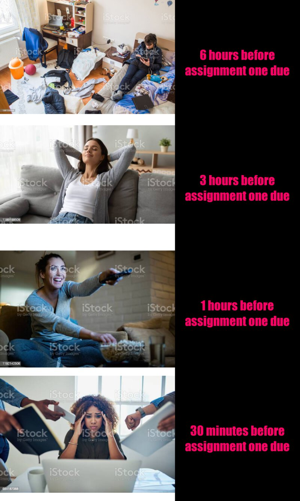

```r

library(magick)
black <- image_blank(width = 500, height = 500, color = "#000000") 

#image one
messy_room <- image_read("https://media.istockphoto.com/photos/teenagers-messy-room-picture-id1087233556") %>%
  image_scale(700)
#image two
relaxing <- image_read("https://media.istockphoto.com/photos/relaxed-serene-young-woman-lounge-on-comfortable-sofa-at-home-picture-id1189188509?s=612x612") %>%
  image_scale(700)
#image three
watching_tv <- image_read("https://media.istockphoto.com/photos/this-is-my-favorite-episode-picture-id1192142506?s=612x612") %>%
  image_scale(700)
#image four 
stressed_work <- image_read("https://media.istockphoto.com/photos/can-i-get-a-moment-to-breathe-picture-id654187068?s=612x612") %>%
  image_scale(700)

#square for text
black_square <- image_blank(width = 500, height = 500, color = "#000000")

#text one
text_1<-black %>%
  image_annotate(text = "6 hours before\nassignment one due",
                 color = "#ff0066",
                 size = 50,
                 font = "Impact",
                 gravity = "center")
#text two
text_2<-black %>%
  image_annotate(text = "3 hours before\nassignment one due",
                 color = "#ff0066",
                 size = 50,
                 font = "Impact",
                 gravity = "center")

#text three
text_3<-black %>%
  image_annotate(text = "1 hours before\nassignment one due",
                 color = "#ff0066",
                 size = 50,
                 font = "Impact",
                 gravity = "center")

#text four
text_4<-black %>%
  image_annotate(text = "30 minutes before\nassignment one due",
                 color = "#ff0066",
                 size = 50,
                 font = "Impact",
                 gravity = "center")

# FIRST ROW
top_row <- image_append(c(messy_room, text_1))

# SECOND ROW
second_row <- image_append(c(relaxing, text_2))

# THIRD ROW
watching_tv_vector <- c(watching_tv, text_3)
third_row <- image_append(watching_tv_vector)

# FORTH ROW
forth_row <- image_append(c(stressed_work, text_4))

# FINAL MEME
meme <- c(top_row, second_row, third_row, forth_row) %>% 
  image_append(stack = TRUE) %>%
  image_scale(800)

image_write(meme, "my_meme.png")
```

